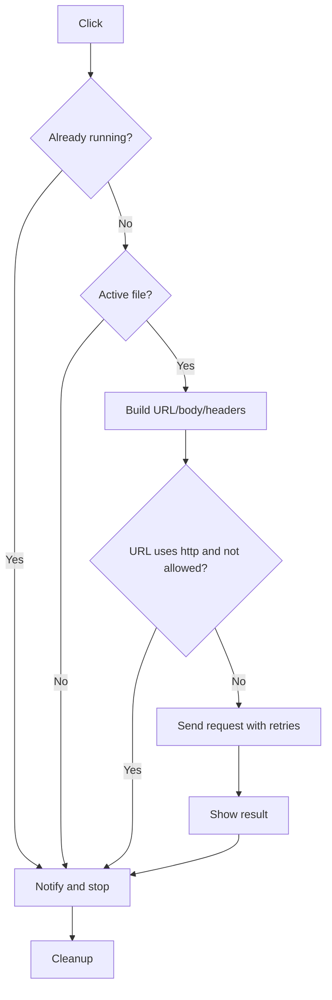

# Назначение и контекст
Плагин предоставляет нижнюю панель с кнопками, каждая из которых отправляет HTTP-запрос во внешний сервис с данными об активной заметке.

## Формальная постановка
- **Входы:** конфигурация кнопки (метод, endpoint, шаблоны), текущий файл (название, путь, имя хранилища).
- **Выходы:** HTTP-запрос на `api.baseUrl + endpoint` с подставленными параметрами; пользовательские уведомления об успехе/ошибке.
- **Ограничения:** до 8 кнопок; таймаут 1–60 с; попытки повтора ≤3; HTTPS по умолчанию.

## Термины и обозначения
- *Контекст* — `{page_title, page_path, vault_name}`.
- *Шаблон* — строка с плейсхолдерами `{key}` для подстановки из контекста.
- *Retry* — повторная попытка с линейным ростом задержки.

## Ключевая идея и стратегия
Комбинация шаблонов и конфигурации позволяет формировать запросы, привязанные к текущей заметке. Алгоритм клика выполняет сбор контекста, построение URL и тела, затем отправляет запрос с таймаутом и повторами.

## Структуры данных и состояние
- Список конфигураций кнопок.
- Набор `running` для отслеживания активных запросов и предотвращения повторных запусков.

## Инварианты и контракт
- **Предусловия:** активный файл существует при отправке; URL не использует `http` если `allowHttp` отключён.
- **Постусловия:** запрос отправлен максимум один раз на кнопку до завершения; UI возвращается в исходное состояние.
- **Инварианты:** кнопка в `running` содержит спиннер, пока запрос не завершён.

## Пошаговый алгоритм
1. При клике проверить, не выполняется ли запрос уже, и что активный файл открыт.
2. Сформировать контекст из названия файла, пути и имени хранилища.
3. Построить URL: базовый адрес + endpoint + query (из шаблона и флагов `pass*`).
4. Сконструировать тело запроса в зависимости от `contentType` и `payloadTemplate`.
5. Сформировать заголовки, включая авторизацию и дополнительные заголовки.
6. Запретить отправку на `http` при `allowHttp=false`.
7. Заблокировать кнопку, показать спиннер и выполнить `requestUrl` с таймаутом и повторами.
8. По успеху показать уведомление `OK`; при ошибке — статус или сообщение.
9. Снять блокировку, убрать спиннер и удалить кнопку из `running`.

## Псевдокод
```text
procedure HANDLE_CLICK(button)
  if button.id in running then notice("Already running")
  file := activeFile()
  if not file then notice("No active file")
  ctx := {title: file.name, path: file.path, vault: vaultName()}
  url := baseUrl + button.endpoint + buildQuery(button, ctx)
  body := buildBody(button, ctx)
  headers := buildHeaders(api, button)
  if not allowHttp and url startsWith "http:" then notice("Insecure HTTP blocked")
  markRunning(button); showSpinner(button)
  timeout := button.timeout or api.timeout
  for attempt in 1..(retries+1)
    try
      response := fetch(url, {method, headers, body, timeout})
      if response.ok then notice("OK"); return
      else notice("Error: status"); return
    catch
      if attempt == retries+1 then raise
      wait(backoffMs * attempt)
  finally
    unmarkRunning(button); removeSpinner(button)
```

## Диаграмма потока (Mermaid)


## Сложность
- Время: O(n + r) где `n` — длина шаблонов, `r` — число попыток; сеть доминирует.
- Память: O(n) для временных строк и заголовков.
- Узкие места: медленные сети и большие шаблоны.

## Корректность
Повторы завершаются после `retries+1` попыток; запрет `http` гарантирует HTTPS по умолчанию.

## Крайние случаи и обработка ошибок
- Отсутствие активного файла → уведомление, кнопки отключены.
- Неправильный JSON в `payloadTemplate` → пустое тело.
- Таймаут или сеть → уведомление "Request failed".

## Конкурентность/асинхронность
Множество кнопок могут работать параллельно; `running` предотвращает повторный запуск одной и той же.

## Численная устойчивость / детерминизм
Не применимо.

## Параметры и тюнинг
- `timeoutMs`, `retries`, `backoffMs` — управляют сетевым поведением.
- `allowHttp` включает небезопасные URL.

## Условия завершения
Запрос завершается после успешного ответа или исчерпания повторов, после чего UI возвращается к исходному состоянию.

## Варианты алгоритма
- GET/POST с разными `contentType`.
- Передача контекста в URL, теле или обоих.

## Пример трассировки
Для заметки `Report.md` и кнопки POST `/run`:
1. URL `https://api.example.com/run`.
2. Тело `{"title":"Report"}`.
3. Уведомление `OK` при статусе 200.

## Набор тестов (минимальный)
- Позитивный: успешный POST JSON.
- Негативный: блокировка HTTP URL.
- Граничный: истечение таймаута.

## Источники истины
- `plugins/api-toolbar/src/main.ts` строки 64–198.
- `plugins/api-toolbar/src/utils/template.ts` строки 1–20.
